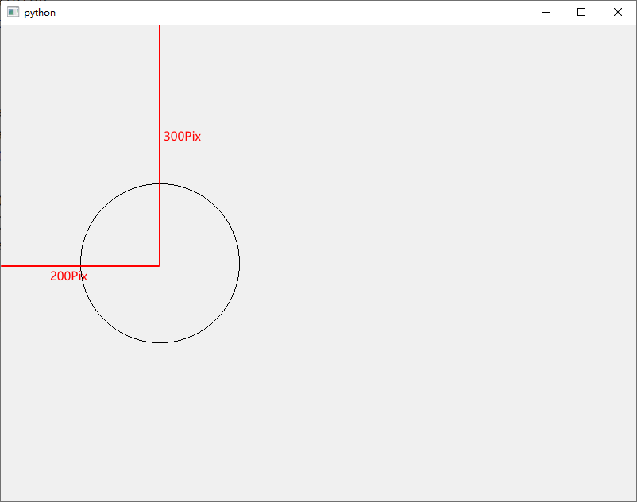
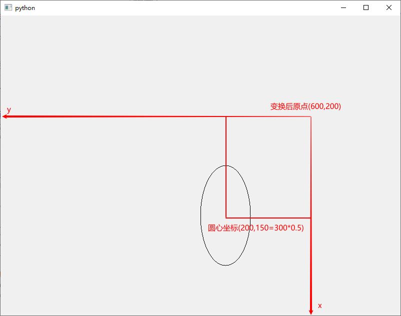

<div align = "center" style = "font-size:25px; font-weight:bold">PyQt的绘图坐标系研究</div>

1. 基本坐标系

   基本坐标系以窗口左上角为原点(0, 0)，水平向右为x轴，垂直向下为y轴，每个单位代表一个像素。

   如图所示，绘制了一个半径为100像素的圆，圆心坐标是(200, 300)。放大和缩小对话框，圆的大小以及相对左上角原点的位置不变。

   ```python
   import sys
   from PyQt5 import QtGui
   from PyQt5.QtCore import QPoint
   from PyQt5.QtGui import QPainter
   from PyQt5.QtWidgets import QWidget, QApplication
   
   
   class QmyWidget(QWidget):
       def __init__(self, parent=None):
           super().__init__(parent)
           self.resize(800, 600)
   
       def paintEvent(self, a0: QtGui.QPaintEvent) -> None:
           painter = QPainter(self)
           painter.drawEllipse(QPoint(200, 300), 100, 100)
   
   
   if __name__ == '__main__':
       app = QApplication(sys.argv)
       form = QmyWidget()
       form.show()
       sys.exit(app.exec_())
   ```

   

   

2. 基本坐标变换

   基本坐标变换分为平移（translate）、坐标旋转（rotate）和缩放（scale）。

   ```python
   import sys
   from PyQt5 import QtGui
   from PyQt5.QtCore import QPoint
   from PyQt5.QtGui import QPainter
   from PyQt5.QtWidgets import QWidget, QApplication
   
   
   class QmyWidget(QWidget):
       def __init__(self, parent=None):
           super().__init__(parent)
           self.resize(800, 600)
   
       def paintEvent(self, a0: QtGui.QPaintEvent) -> None:
           painter = QPainter(self)
           painter.translate(600, 200)	# 原点平移到(600, 200)
           painter.rotate(90)	# 旋转90度
           painter.scale(1, 0.5)	# 缩放因子，x轴是1，y轴是0.5，实际坐标=原坐标*缩放因子
           painter.drawEllipse(QPoint(200, 300), 100, 100)
   
   
   if __name__ == '__main__':
       app = QApplication(sys.argv)
       form = QmyWidget()
       form.show()
       sys.exit(app.exec_())
   ```

   

   

3. 窗口和视口

   窗口（window）可以理解为绘画的一块画板，是逻辑上的一块矩形区域

   视口（viewport）就是观察画板的一扇窗口，对应物理上的一块矩形区域

   窗口和视口坐标有一一映射关系，简单来讲就是作图的时候只需要考虑窗口坐标，然后图画好以后系统自动将窗口映射到视口。

   如果希望图形随着Qwidget的大小改变而变化，一般将视口大小与Qwidget.width()和Qwidget.height()建立联系

4. 123