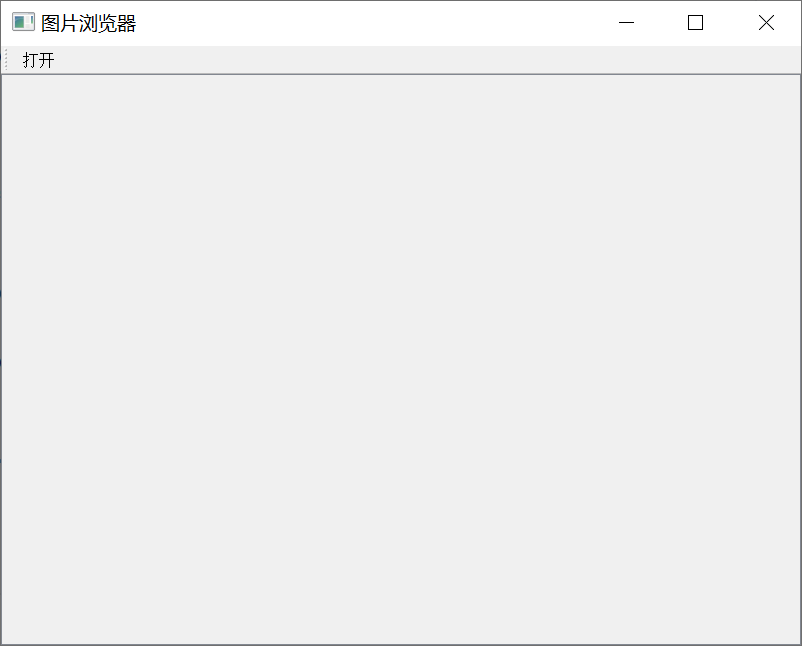
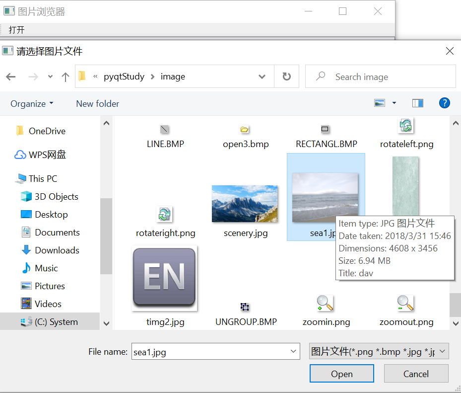
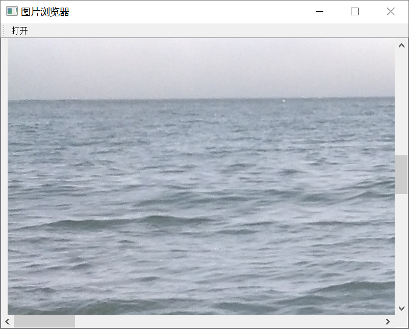
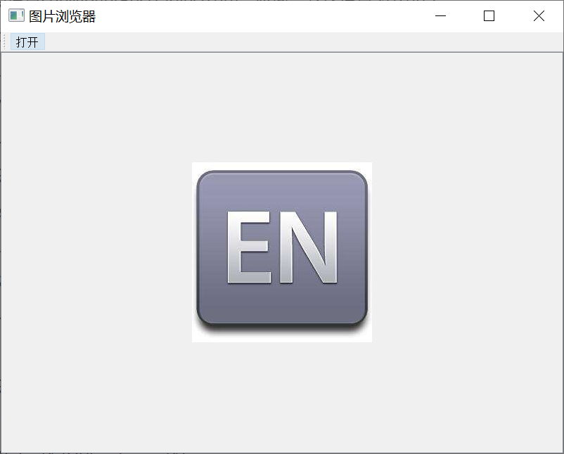

#### 一，目标

​	实现简单的图片浏览器，有一个打开按钮，点击该按钮弹出选择窗口，在电脑磁盘中选择图片文件并打开

#### 二，组件架构

QMainWindow

|----QScrollArea (CentralWidget)

​		|----QWidget (QVboxLayout)

​				|----QLabel (QPixmap)

#### 三，注意事项

1. QScrollArea一般需要配合一个QWidget作为内部容器使用
2. QScrollArea的widgetResizable属性用于控制滚动区域的内容部署层是否应跟随滚动区域的大小变化进行大小跟随调整，一般设置为True
3. QLabel需要设置居中显示

#### 四，代码

```python
import sys

from PyQt5.QtCore import Qt
from PyQt5.QtGui import QPixmap
from PyQt5.QtWidgets import QMainWindow, QScrollArea, QWidget, QVBoxLayout, QLabel, QApplication, QAction, QToolBar, \
    QFileDialog


class QmyMainWindow(QMainWindow):
    def __init__(self, parent=None):
        super().__init__(parent)
        self.resize(800, 600)
        self.setWindowTitle("图片浏览器")
        self.qScrollArea = QScrollArea(self)
        self.qScrollArea.setWidgetResizable(True)
        self.setCentralWidget(self.qScrollArea)

        self.qWidget = QWidget()
        self.qScrollArea.setWidget(self.qWidget)

        self.qVBoxLayout = QVBoxLayout()
        self.qWidget.setLayout(self.qVBoxLayout)

        self.qLabel = QLabel()
        self.qVBoxLayout.addWidget(self.qLabel)
        self.qLabel.setAlignment(Qt.AlignCenter)

        self.qToolBar = QToolBar()
        self.qAction = QAction("打开")
        self.qToolBar.addAction(self.qAction)
        self.addToolBar(self.qToolBar)

        self.qAction.triggered.connect(self.openImage)

    def openImage(self):
        file, filter = QFileDialog.getOpenFileName(self, "请选择图片文件", "", "图片文件(*.png *.bmp *.jpg *.jpeg)")
        self.qLabel.setPixmap(QPixmap(file))

if __name__ == '__main__':
    app = QApplication(sys.argv)
    mw = QmyMainWindow()
    mw.show()
    sys.exit(app.exec_(), )
```

#### 五，效果展示

如果图片过大则显示滚动条，图片小则显示原图







