#### 一，开发环境安装

1. 什么是Python Qt？

   ​		Qt是一个跨平台的应用程序C++开发库类。PyQt是Qt C++类库的Python绑定，PyQt5对应于Qt5类库。使用PyQt5可以充分利用Qt应用程序开发框架和功能丰富的类设计GUI程序

   

2. PyQt5安装。

   直接使用下面的命令安装PyQt5

   ```shell
   pip install PyQt5
   ```


#### 二，PyQt5 GUI程序框架

1. PyQt5 GUI程序的基本框架

   ```python
   import sys
   from PyQt5 import QtWidgets
   
   app = QtWidgets.QApplication(sys.argv)
   w = QtWidgets.QWidget()
   
   w.resize(300, 300)
   w.setWindowTitle("Hello")
   
   w.show()
   sys.exit(app.exec_())
   ```

   

2. 用UI Designer可视化设计窗体

3. 将ui文件编译为py文件

   ```shell
    pyuic5 -o ui_Dialog.py Dialog.ui
   ```

   

4. 界面与逻辑分离的GUI程序框架

   ```python
   import sys
   from PyQt5.QtWidgets import QWidget, QApplication
   
   class Qw(QWidget):
       def __init__(self, parent=None):
           super().__init__(parent)
           self.ui = Ui_xxx()
           self.ui.setupUi(self)
           
   if __name__ == '__main__':
       app = QApplication(sys.argv)
       mw = Qw()
       mw.show()
       sys.exit(app.exec_())
   ```

   

5. 为组建的内建信号编写槽函数

   setupUi()函数最后一行定义了信号自动关槽函数的规则

   ```python
   QtCore.QMetaObject.connectSlotsByName(Widget)
   on_<object name>_<signal name>(<signal parameters>)
   ```

   自动关联槽函数举例

   ```python
   def on_btnClear_clicked(self):
       ...
   def on_chkBoxUnder_clicked(self):
       ...
   ```

   overload型信号的处理

   ```python
   @pyqtSlot(bool)
   def on_chkBoxItalic_clicked(self, checked)
   ```

   

6. 自定义信号

   要自定义信号，类必须是QObject的子类

   ```python
   from PyQt5.QtCore import QObject, pyqtSignal, pyqtSlot
   
   class Human(QObject):
       ageChanged = pyqtSignal([int], [str])
       def setAge(self, age):
           self._age = age
           self.ageChanged.emit(self._age)
           ageInfo = "age"
           self.ageChanged[str].emit(ageInfo)
   
   class Respomsor(QObject):
       @pyqtSlot(int)
       def do_ageChanged_int(self, age):
           print(age)
       @pyqtSlot(str)
       def do_ageChanged_str(self, ageInfo):
           print(ageInfo)
   
   boy = Human()
   resp = Respomsor()
   boy.ageChanged.connect(resp.do_ageChanged_int)
   boy.ageChanged[str].connect(resp.do_ageChanged_str)
   boy.setAge(10)
   ```

   

7. 资源文件的使用

   Qt Creator里新建Qt Resource File

   文件编译，注意不要移动文件路径

   ```shell
   pyrcc5 .\QtApp\res.qrc -o res_rc.py
   ```


#### 三，常用界面组件的使用

1. LineEdit

   

2. ButtonCheck

   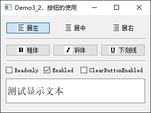

3. ProgressBar

   <span style='color:red'>垂直ProgressBar的显示问题</span>

   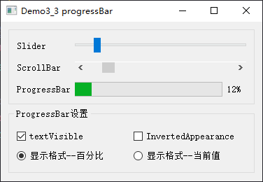

4. DateTime

   <span style='color:red'>currentSection</span>

   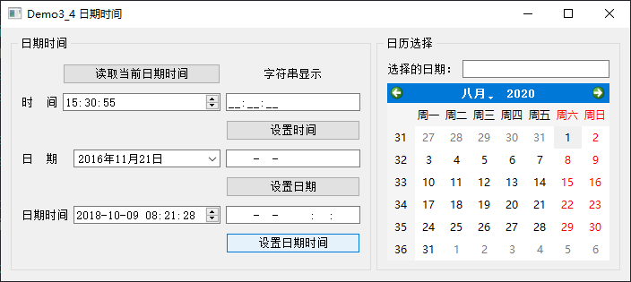

5. Timer

   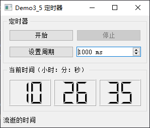

6. ComboBox

   <span style='color:red'>addPixmap</span>

   注意myWidget.py 49行增加关联数据

   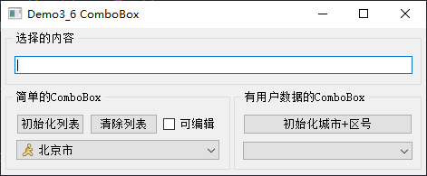

7. Actions

   <span style='color:red'>customContextMenuRequested信号，setFontPointSize的参数类型qreal</span>

   （1）设置字体注意mergeCurrentCharFormat

   （2）QPlainTextEdit的信号copyAvailable，触发时将cut和copy按钮enabled状态设置为信号bool状态，paste按钮enabled状态设置为canPaste()

   （3）QPlainTextEdit的信号selectionChanged，触发时将粗体斜体下划线按钮checked设置为currentCharFormat的状态

   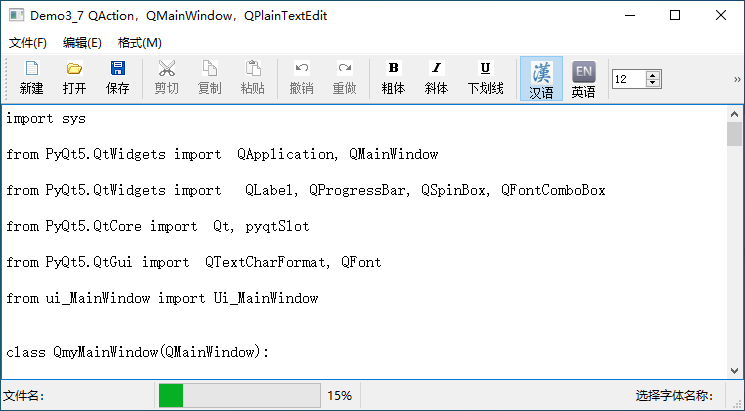

8. ListWidget

   （1）注意setFlags，给每个QListWidgetItem设置

   （2）右键菜单，触发customContextMenuRequested信号，然后qMenu.exec(QCursor.pos())

   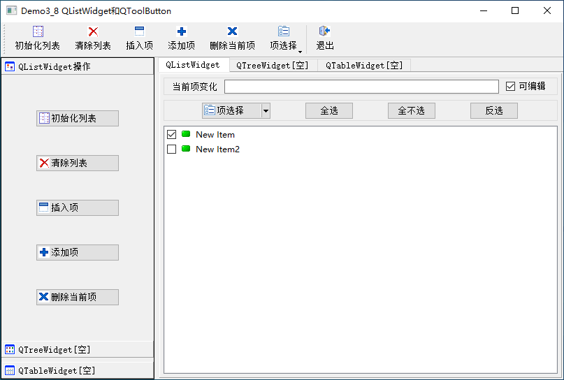

9. TreeDock

   ```mermaid
   graph LR
       qTreeView --> |"header()"| qHeaderList
   ```

   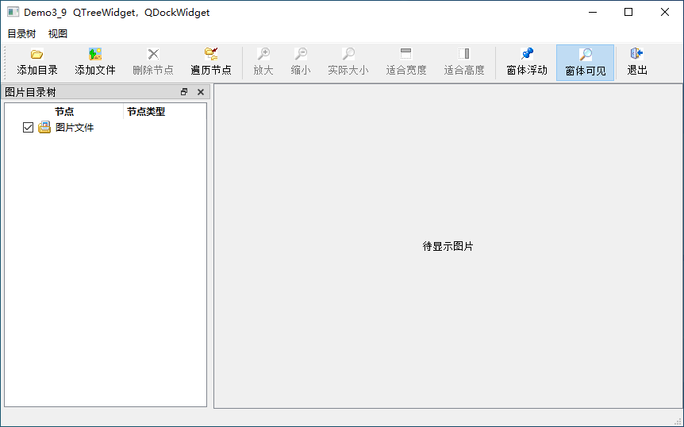

10. 123

11. 123

#### 四，Model/View结构

1. FileSys

   ```mermaid
   graph LR
       QTableView --> |"setModel"| QFileSystemModel
       QListView --> |"setModel"| QFileSystemModel
       QTreeView --> |"setModel"| QFileSystemModel
   ```

   ```mermaid
   graph LR
       QTreeView --> |"Signal clicked(QModelIndex index) from QAbstractItemView"| Slot_ListView.setRootIndex
       QTreeView --> |"Signal clicked(QModelIndex index) from QAbstractItemView"| Slot_TableView.setRootIndex
       QTreeView --> |"Signal clicked(QModelIndex index) from QAbstractItemView"| 文件信息
   ```

   

   

   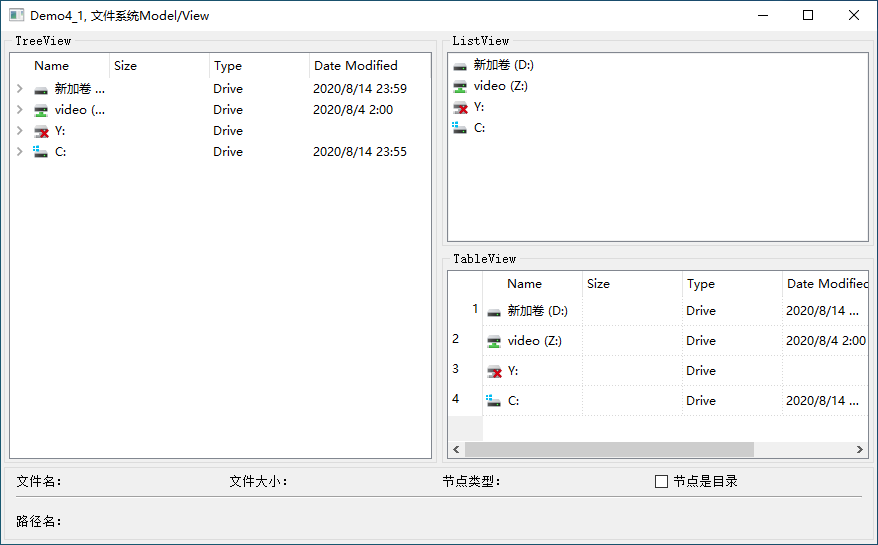

   

2. StringList

   ```mermaid
   graph LR
       QListView --> |"setModel"| QStringListModel
   ```

   model的返回值是int

   view的返回值是QModelIndex，用currentIndex()获得

   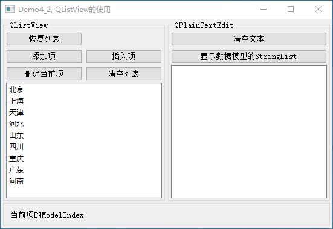

3. ItemModel

   ```mermaid
   graph LR
       QTableView --> |"setModel"| QStandardItemModel --> |"setItem"| QStandardItem
       QTableView --> |"setSelectionModel"| QItemSelectionModel
   ```

   ```mermaid
   graph LR
       QItemSelectionModel --> |"Signal currentChanged(QModelIndex current, QModelIndex previous)"| 单元格信息
   ```

   QItemSelectionModel负责选择，主要方法为hasSelection、selectedIndexes、clearSelection、currentIndex、setCurrentIndex

   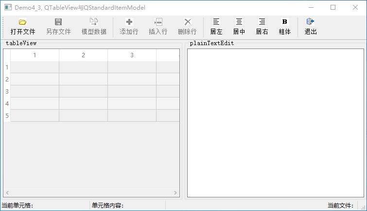

4. Delegate

   ```mermaid
   graph LR
       QTableView --> |"setItemDelegateForColumn"| 自定义代理类
   ```

   自定义代理类必须继承以下四个函数：

   （1）createEditor。返回一个代理QWidget

   （2）setEditorData。已知QAbstractItemModel的值，设置代理QWidget的值

   （3）setModelData。已知代理QWidget的值，设置QAbstractItemModel的值

   （4）updateEditorGeometry。设置显示效果

5. 123